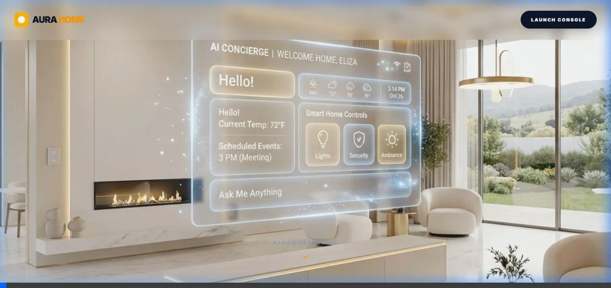

# Aura Sovereign — Home Intelligence & Orchestration Node 🛡️💎🚀



**Aura** is a voice-activated, multimodal home co-pilot that restores **Sovereignty** to the modern consumer. Built for the **Google Cloud Rapid Agent Hackathon**, Aura moves beyond the chatbot and into the world of **Autonomous Resolution.**

**Live Deployment:** [https://aura-home-ai-eight.vercel.app/](https://aura-home-ai-eight.vercel.app/)
**Master Film:** [Watch the 3-Minute Cinematic Demo](https://aura-home-ai-eight.vercel.app/film)

---

## 🎯 The Vision: Senses. Reasons. Acts.
The modern home is becoming an unmanaged enterprise of "subscription creep," energy waste, and security gaps. Aura solves these systematic leaks using a hierarchy of seven specialized agents that don't just provide answers—they take **Autonomous Action.**

### The Aura Seven (Specialist Hierarchy)
*   **Finance Sentinel:** Autonomously audits subscriptions and identifies the $920/yr household "Shadow Tax."
*   **Guardian Protocol:** Reasons across Multimodal Agentic Sensors to secure the home perimeter.
*   **Energy Architect:** Dynamically shifts HVAC loads to match peak utility rates (Reducing waste by ~25%).
*   **Pantry Pilot:** Monitors inventory and reroutes orders to local market value leaders.
*   **Wellness Warden:** Tracks family health metrics and automates prescription renewals.
*   **Time Weaver:** Orchestrates complex calendars and handles the "Mental Load" of household logistics.
*   **Vision Advisor:** Uses Gemini 2.0 Vision for live operational intelligence of the operative home field.

---

## 🛠️ Technical Stack (The Sovereign Architecture)

### AI & Orchestration
*   **Intelligence:** Powered by **Gemini 2.0 Flash** via Vertex AI.
*   **Framework:** **Google Agentic Design Kit (ADK)** for multi-agent routing and state management.
*   **Sensory Input:** Multimodal Agentic Sensors (Native Audio PCM + Live Vision Streams).

### Persistence (Partner Track: MongoDB MCP)
*   **The Sovereign Vault:** We implemented the **Model Context Protocol (MCP)** using **MongoDB Atlas** to ensure every decision is grounded in a persistent, secure, and private data vault owned by the user.

### Infrastructure
*   **Frontend:** Next.js 16 (Turbopack) + Framer Motion + Vanilla CSS.
*   **Backend:** Cloud Run (Agentic Workers) + Vercel (Edge Runtime).
*   **Video Engine:** Custom **Director Stack** (Playwright + FFmpeg + Microsoft Neural TTS).

---

## 🎬 Autonomous Video Engine (The "Director Stack")
Aura includes a built-in autonomous producer that documents its own capabilities. 

**To generate a high-fidelity narrated demo:**
```bash
npm install
npx tsx scripts/generate-demo.ts
```
This triggers the **DemoDirectorAgent** to record the browser, the **VoiceoverAgent** to generate Microsoft Neural narration, and the **VideoComposerAgent** to merge them into a master cinematic film.

---

## 🚀 Getting Started

1.  **Clone the Repo:** `git clone https://github.com/QuisTech/aura-home-ai`
2.  **Install Dependencies:** `npm install`
3.  **Configure Environment:** Create a `.env` with your `GOOGLE_API_KEY` and `MONGODB_URI`.
4.  **Run Development:** `npm run dev`

---

## 🏆 Hackathon Tracks
*   **Main Track:** Google Cloud Rapid Agent Hackathon.
*   **Partner Track:** **MongoDB** (Full MCP Integration via the Sovereign Vault).

---

### 🛡️ Built by QuisTech for the Google Cloud Rapid Agent Hackathon.
