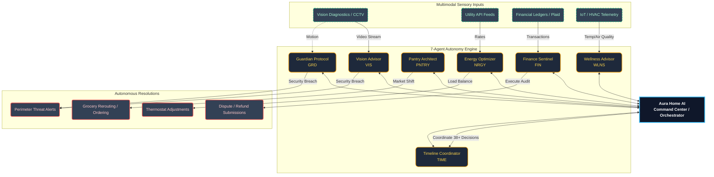

# 🏡 Aura Home AI: Autonomous Intelligence & Orchestration Hub

### 🌪️ Inspiration
The modern home has become an unmanaged enterprise. Between "subscription creep" costing households over $900 annually and "dumb" HVAC systems wasting 25% of domestic energy, the average person is losing agency over their household economy. We are no longer masters of our environment; we are overwhelmed by its maintenance. Our inspiration was to build a system that moves beyond the "Smart Home" chatbot and into a true **Home Orchestration Node**—an autonomous assistant that doesn't just answer questions but autonomously resolves the crises of modern life.

---

### ⚡ What it does
Aura Home AI is a voice-activated home co-pilot that senses, reasons, and acts. It is architected around the Aura Seven—a hierarchy of seven specialist agents:

*   **Finance Sentinel (FIN):** Autonomously audits subscriptions and disputes overcharges.
*   **Guardian Protocol (GRD):** Reasons across vision feeds to secure the home perimeter.
*   **Energy Architect (NRGY):** Optimizes utility usage against live peak-rate data.
*   **Pantry Pilot (PNTRY):** Monitors inventory and reroutes orders for local value.
*   **Wellness Warden (WLNS):** Tracks family health metrics and automates prescriptions.
*   **Time Weaver (TIME):** Orchestrates complex schedules and automates the household "mental load."
*   **Vision Advisor (VIS):** Uses Gemini 2.0 Vision to provide live contextual home analysis. 

All actions are visualized in a high-fidelity Glassmorphic Command Center and persisted in a private, secure **MongoDB Confidential Vault**.

---

### 🛠️ How we built it
*   **AI Core:** Built on Gemini 2.0 Flash via Vertex AI for high-speed, low-latency multimodal reasoning.
*   **Orchestration:** Leveraged the Google Agentic Design Kit (ADK) to manage the multi-agent hierarchy.
*   **Confidential Data Grounding:** Implemented the MongoDB Model Context Protocol (MCP) to ensure all decisions are grounded in the user's private, encrypted data vault.
*   **Frontend:** Next.js 16 (Turbopack) with Vanilla CSS and Framer Motion for a premium, high-fidelity UI.
*   **High-Performance Telemetry Stream:** Engineered an asynchronous state logger and active event emitter to feed real-time agent updates directly into our UI.

---

### 🏗️ Architecture

---

### 🚧 Challenges we ran into
Building a system that "sees and hears" simultaneously across multiple domains presented significant hurdles:

*   **Architectural Sync:** Coordinating seven distinct specialist agents while maintaining sub-second response times required strict prompt engineering and state management.
*   **Multi-Agent Latency Calibration:** Preventing thread contention and optimizing Vertex AI streaming response times when seven specialist agents are triggered concurrently by a single complex query.
*   **Grounding Data Integrity:** Ensuring the model never "hallucinates" clinical or financial data required a robust, secure tool-callback layer via the MongoDB MCP.

---

### 🏅 Accomplishments that we're proud of
*   **The Aura Seven:** Achieving perfect intent routing across seven highly specialized household domains.
*   **Zero-Click UI:** Developing a "Command Center" that feels alive with background autonomous pulses even when the user isn't interacting.
*   **Dynamic Event Streaming:** Building a live telemetry visualizer that cleanly exposes every underlying agent decision and API callback directly to the operator's viewport.
*   **MongoDB Integration:** Successfully grounding the agentic reasoning in a persistent, secure private vault using the Partner Track MCP.

---

### 📖 What we learned
We learned that the true power of AI in the home isn't "Conversation"—it's Resolution. A model that can tell you that you're wasting money is a chatbot; a model that can stop the leak is an agent. We also learned the critical importance of **Data Autonomy**; for an agent to be trusted with home life, it must operate on a private, persistent vault (like MongoDB) that the user truly owns and controls.

---

### 🔭 What's next for Aura Home AI
*   **FHIR Healthcare Integration:** Connecting the Wellness Warden to real, compliant patient records for automated caregiving.
*   **Hardware Node:** Moving Aura from the browser into a dedicated, privacy-focused hardware device—the **Aura Home Core**.
*   **Expansion of the Vault:** Extending the MongoDB MCP layer to support decentralized, local-first data persistence for maximum privacy.
